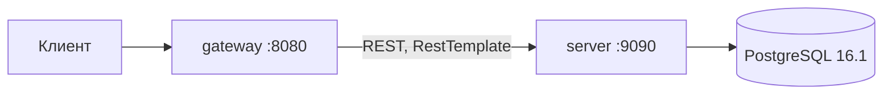

# ShareIt

Сервис шеринга вещей: пользователи выкладывают вещи, которыми готовы поделиться, находят нужные им вещи и бронируют их на определённое время. Если нужной вещи нет, можно оставить запрос — и другие пользователи добавят её в ответ на этот запрос.

Приложение разделено на два самостоятельных сервиса.

* **Шлюз** (`gateway`) — принимает HTTP-запросы, проверяет их корректность и передаёт дальше. Бизнес-логики не содержит и в базу данных не ходит.
* **Сервер** (`server`) — вся бизнес-логика и работа с PostgreSQL. Считает, что запрос уже прошёл валидацию.



Разделение даёт две вещи: сервер не тратит ресурсы на разбор заведомо некорректных запросов, а правила валидации живут в одном месте и меняются без пересборки сервера.

## Стек

Java 21 · Spring Boot 3.3.2 · Spring Web · Spring Data JPA · Hibernate · PostgreSQL 16.1 · H2 (тесты) · Maven (многомодульный) · Lombok · Docker / Docker Compose · JUnit 5 · MockMvc · Checkstyle · SpotBugs · JaCoCo

## Структура модулей

```
shareit
├── gateway    валидация запросов и проксирование на сервер (RestTemplate)
└── server     бизнес-логика, JPA-сущности, доступ к PostgreSQL
```

Каждый модуль — самостоятельное Spring Boot приложение со своим `Dockerfile`.

## Запуск

Требуются Docker и JDK 21.

```bash
mvn clean package
docker-compose up --build
```

Поднимаются три контейнера:

| Контейнер | Назначение | Порт |
|---|---|---|
| `shareit-gateway` | шлюз, точка входа для клиента | 8080 |
| `shareit-server` | сервер бизнес-логики | 9090 |
| `postgres` | PostgreSQL | 6541 |

Схема базы создаётся из [`schema.sql`](server/src/main/resources/schema.sql) при старте: `ddl-auto=none`, генерация схемы Hibernate отключена намеренно, чтобы структура таблиц и ограничения были заданы явно и не зависели от версии ORM.

## Идентификация пользователя

Авторизации в проекте нет: идентификатор текущего пользователя передаётся заголовком

```
X-Sharer-User-Id: 1
```

Заголовок обязателен для всех эндпоинтов, кроме операций над пользователями.

## API

### Пользователи

| Метод | Эндпоинт | Описание |
|---|---|---|
| POST | `/users` | создать пользователя |
| PATCH | `/users/{userId}` | обновить поля пользователя |
| GET | `/users/{userId}` | пользователь по идентификатору |
| GET | `/users` | список пользователей |
| DELETE | `/users/{userId}` | удалить пользователя |

Электронная почта уникальна — на уровне базы стоит ограничение `uq_users_email`, повторная регистрация того же адреса возвращает `409`.

### Вещи

| Метод | Эндпоинт | Описание |
|---|---|---|
| POST | `/items` | добавить вещь |
| PATCH | `/items/{itemId}` | изменить вещь (только владелец) |
| GET | `/items/{itemId}` | карточка вещи |
| GET | `/items` | вещи текущего пользователя |
| GET | `/items/search?text=` | поиск доступных вещей по названию и описанию |
| POST | `/items/{itemId}/comment` | оставить отзыв о вещи |

Особенности поведения:

* Карточка вещи возвращается вместе с комментариями. Даты **последнего и ближайшего бронирования** добавляются только владельцу вещи — остальным пользователям эти поля не показываются.
* Поиск по пустой строке возвращает пустой список, а не все вещи: пустой запрос — это отсутствие критерия, а не критерий «любая вещь».
* Оставить отзыв можно только после завершённого бронирования этой вещи. Иначе — `400`.

### Бронирования

| Метод | Эндпоинт | Описание |
|---|---|---|
| POST | `/bookings` | создать бронирование |
| PATCH | `/bookings/{bookingId}?approved=` | подтвердить или отклонить (только владелец вещи) |
| GET | `/bookings/{bookingId}` | бронирование по идентификатору |
| GET | `/bookings?state=&from=&size=` | свои бронирования |
| GET | `/bookings/owner?state=&from=&size=` | бронирования вещей, принадлежащих пользователю |

Получить бронирование может только его автор или владелец вещи.

### Запросы вещей

| Метод | Эндпоинт | Описание |
|---|---|---|
| POST | `/requests` | создать запрос на вещь |
| GET | `/requests` | свои запросы вместе с ответами на них |
| GET | `/requests/all?from=&size=` | запросы других пользователей |
| GET | `/requests/{requestId}` | запрос по идентификатору |

## Жизненный цикл бронирования

| Статус | Когда наступает |
|---|---|
| `WAITING` | бронирование создано и ждёт решения владельца вещи |
| `APPROVED` | владелец подтвердил бронирование |
| `REJECTED` | владелец отклонил бронирование |
| `CANCELED` | бронирование отменено |

Списки бронирований фильтруются параметром `state`, который задаёт не статус, а **выборку**:

`ALL` · `CURRENT` (идут сейчас) · `PAST` (завершённые) · `FUTURE` (будущие) · `WAITING` · `REJECTED`

Значение по умолчанию — `ALL`. Пагинация: `from` (смещение, от нуля) и `size` (размер страницы, по умолчанию 10).

## Модель данных

| Таблица | Назначение |
|---|---|
| `users` | пользователи, уникальная почта |
| `items` | вещи: владелец, доступность, необязательная ссылка на запрос |
| `bookings` | бронирования: период, вещь, автор, статус |
| `comments` | отзывы о вещах |
| `requests` | запросы на вещи, которых пока нет в сервисе |

Целостность обеспечивается на уровне базы, а не только кодом: внешние ключи на `users`, `items` и `requests`, уникальность почты и проверка `booking_dates_check` — дата окончания бронирования строго больше даты начала.

Связи `Item → User` и `Item → ItemRequest` объявлены `@ManyToOne(fetch = LAZY)`, чтобы выборка списка вещей не тянула за собой владельцев и запросы, пока они действительно не понадобятся.

## Валидация

Проверка входных данных целиком лежит на шлюзе.

* **Группы валидации** `Create` и `Update` позволяют одному DTO обслуживать оба сценария: при создании пользователя имя и почта обязательны, при обновлении — приходят только изменяемые поля, и обязательность не применяется.
* **Даты бронирования** проверяются на уровне DTO: обе обязательны, обе в будущем, и отдельная проверка `@AssertTrue` требует, чтобы окончание было позже начала, — такое условие нельзя выразить аннотацией на отдельном поле.
* **Параметры пагинации** ограничены: `from` — неотрицательное, `size` — положительное.

## Обработка ошибок

Ошибки возвращаются единым телом с полем `error`.

| Код | Когда возвращается |
|---|---|
| 400 | некорректные данные или нарушение условий операции |
| 403 | действие доступно только владельцу |
| 404 | объект не найден |
| 409 | нарушение уникальности |

## Тестирование

```bash
mvn test
```

* **Интеграционные тесты сервисного слоя** (`@SpringBootTest` + `@Transactional`) — проходят полный путь от сервиса до базы на **H2 в режиме совместимости с PostgreSQL**, поэтому проверяется в том числе поведение JPA и ограничений схемы, а не только логика в отрыве от хранилища.
* **Тест контроллера** (`@WebMvcTest` + `MockMvc`) — проверяет контракт HTTP-слоя с подменённым сервисом.
* **Тест сериализации** (`@JsonTest`) — фиксирует формат DTO бронирования, чтобы изменение полей не сломало клиентов молча.

Коллекция Postman для ручной проверки API: [`postman/sprint.json`](postman/sprint.json).

## Качество кода

В сборку подключены три инструмента, проверяющие код независимо друг от друга:

| Инструмент | Что делает |
|---|---|
| Checkstyle 10.3 | единый стиль по [`checkstyle.xml`](checkstyle.xml) |
| SpotBugs 4.8.5 | статический анализ, поиск типовых дефектов |
| JaCoCo 0.8.12 | отчёт о покрытии тестами |
